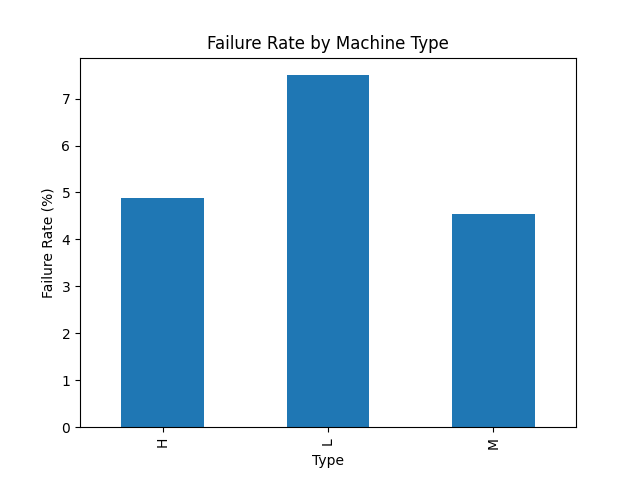
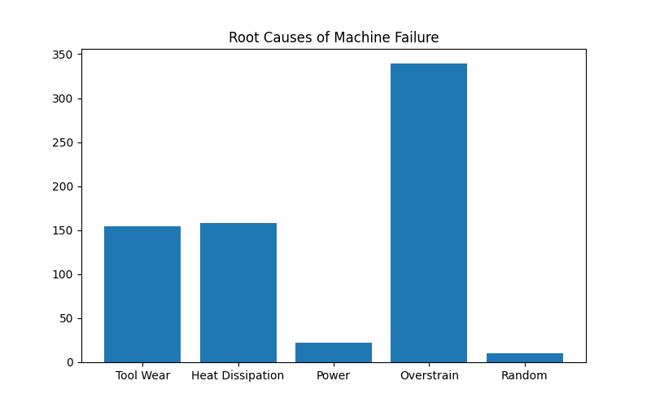
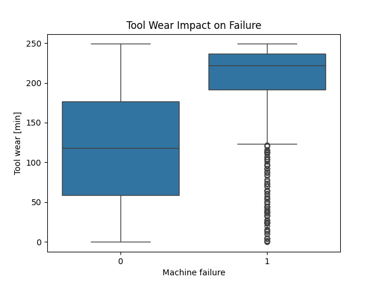
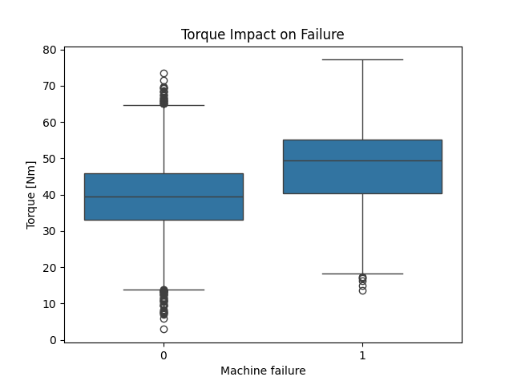
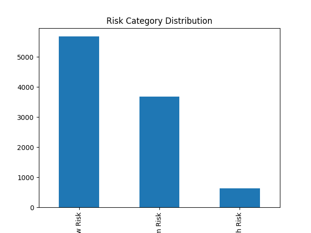

# Smart Factory Decision Intelligence System

## Project Overview
An AI-powered predictive maintenance and decision intelligence system for smart manufacturing. This project analyzes industrial machine data, identifies failure patterns, predicts machine failures, and provides business recommendations to reduce downtime and operational losses.

## Business Problem
Unexpected machine failures can lead to production downtime, increased maintenance costs, and financial losses. Manufacturing organizations need proactive systems that can identify high-risk machines and recommend preventive actions before failures occur.

## Dataset
- Dataset: AI4I 2020 Predictive Maintenance Dataset
- Total Records: 10,000
- Features: Temperature, Torque, Rotational Speed, Tool Wear, and Failure Indicators

- ## Key Findings
- Failure Rate: 6.38%
- Total Failures: 638 machines
- Estimated Financial Loss: ₹31,900,000
- High-Risk Machines Identified: 637
- Major Failure Cause: Overstrain Failure

- ## Machine Learning Model
**Algorithm Used:** Random Forest Classifier

### Model Performance
- Accuracy: 96.45%
- Precision: 88%
- Recall: 56%
- F1 Score: 68%

- ## Key Predictors of Machine Failure
1. Tool Wear (30.1%)
2. Torque (29.6%)
3. Rotational Speed (14.1%)
4. Air Temperature (13.3%)
5. Process Temperature (13.0%)

 ## Business Recommendations
### High-Risk Machines
- Replace tools immediately.
- Schedule preventive maintenance.
- Prioritize these machines for inspection.

### Medium-Risk Machines
- Reduce machine load.
- Monitor tool wear and torque regularly.
- Plan maintenance during non-production hours.

### Low-Risk Machines
- Continue routine monitoring.
- Maintain standard operating procedures.

- ## Business Impact
This system enables manufacturing organizations to:
- Predict machine failures before breakdowns occur
- Reduce unexpected downtime
- Lower maintenance costs
- Prioritize resources using risk scores
- Support data-driven decision-making in smart factories

- ## Technologies Used
- Python
- Pandas
- NumPy
- Matplotlib
- Seaborn
- Scikit-Learn
- Jupyter Notebook
- Git & GitHub

- ## Project Structure
SmartFactoryDecisionIntelligence/
│
├── Data/
├── Images/
├── Notebooks/
├── Report/
├── smart_factory.ipynb
└── requirements.txt

## Future Improvements
- Real-time IoT sensor integration
- Interactive Streamlit dashboard
- Automated maintenance alerts
- Failure probability monitoring system
- Cost optimization engine

- ## Visualizations

### Failure Rate by Machine Type

### Root Causes of Machine Failure

### Tool Wear vs Machine Failure

### Torque vs Machine Failure

### Risk Category Distribution

